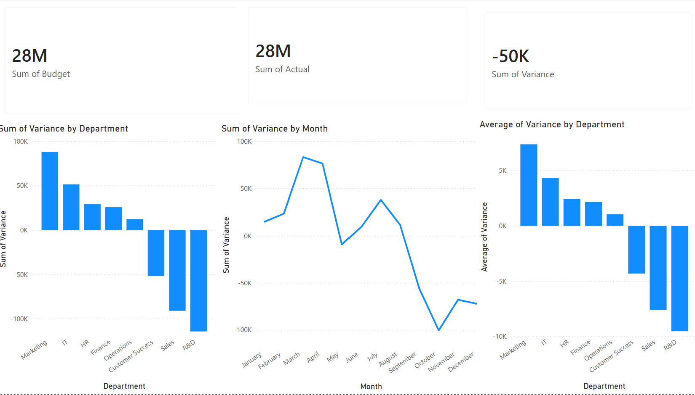

# FP&A Budget Variance Analysis

## Overview
Analysis of monthly budget vs. actual spending across 8 departments over 12 months, using SQL for data analysis and Power BI for visualization. The project replicates core FP&A and Controlling workflows: variance identification, trend analysis, and actionable recommendations.

## Tools
SQL (SQLiteOnline) · Power BI

## Key Findings
- Total budget: $28.2M across 8 departments; actual spending came in $50K under budget overall
- Marketing and IT were the most significant overspending departments, exceeding budget by $88K and $51K respectively
- R&D and Sales were the largest underspenders, finishing $114K and $91K below budget
- Spending shifted from over-budget in Q1 (peaking in March/April) to significantly under-budget in Q4, with October showing the largest negative variance across all departments
- R&D's largest single-month variance occurred in December (-8.4%), suggesting year-end budget reallocation or project delays

## Recommendations
- Marketing and IT should implement mid-year budget reviews to catch overspending earlier
- The consistent Q4 underspending pattern across departments suggests budgets may be front-loaded; a rolling forecast approach could improve accuracy
- R&D's December variance warrants investigation into whether unspent budget was reallocated or project timelines slipped

## Dashboard

## Files
| File | Description |
|------|-------------|
| `analysis_queries.sql` | SQL queries including window functions and CTEs |
| `fpa_variance_data_monthly.csv` | Source dataset |
| `FPA_Variance_Dashboard.pbix` | Power BI dashboard file |
| `fpa-variance-analysis.png` | Dashboard screenshot |# fpa-variance-analysis
